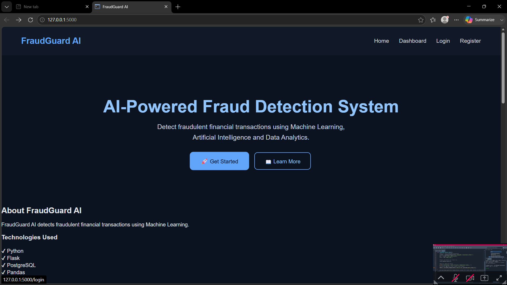

# 🛡️ FraudGuard AI - Fraud Detection System Using Machine Learning

## 📖 Overview

FraudGuard AI is a web-based application that detects fraudulent financial transactions using Machine Learning. The system allows users to register, log in securely, upload transaction datasets in CSV format, analyze them using the Isolation Forest algorithm, and identify suspicious transactions. It also generates a downloadable fraud report for further analysis.

This project demonstrates the integration of Machine Learning with web development and database management to build a practical fraud detection solution.

---

## ✨ Features

- 👤 User Registration and Login
- 🔐 Secure Authentication
- 📂 Upload CSV Transaction Files
- 🤖 Fraud Detection using Isolation Forest
- 📊 Interactive Dashboard
- 🚨 Display Fraudulent Transactions
- 📥 Download Fraud Report (CSV)
- 🗄️ PostgreSQL Database Integration
- 🚪 Secure Logout

---

## 🧠 Machine Learning

**Algorithm Used:** Isolation Forest

Isolation Forest is an unsupervised anomaly detection algorithm designed to identify rare and unusual observations within a dataset. Since fraudulent financial transactions are uncommon compared to legitimate ones, Isolation Forest is well suited for detecting such anomalies.

---

## 🛠️ Technologies Used

| Category | Technology |
|----------|------------|
| Programming Language | Python |
| Backend Framework | Flask |
| Machine Learning | Scikit-learn |
| Data Processing | Pandas |
| Database | PostgreSQL |
| Model Storage | Joblib |
| Frontend | HTML, CSS |

---

## 📂 Project Structure

```
Fraud-Detection-System/
│
├── app.py
├── model.py
├── fraud_model.pkl
├── requirements.txt
│
├── database/
│   └── db.py
│
├── dataset/
│
├── static/
│   └── css/
│
├── templates/
│   ├── index.html
│   ├── login.html
│   ├── register.html
│   ├── dashboard.html
│   ├── prediction.html
│   └── result.html
│
├── utils/
│   └── predictor.py
│
└── README.md
```

---

## ⚙️ Installation

### Clone the repository

```bash
git clone https://github.com/sambartika07/Fraud-Detection-System.git
```

### Navigate to the project folder

```bash
cd Fraud-Detection-System
```

### Install dependencies

```bash
pip install -r requirements.txt
```

### Run the application

```bash
python app.py
```

Open your browser and visit:

```
http://127.0.0.1:5000
```

---

## 🚀 How It Works

1. Register a new user account.
2. Log in to the system.
3. Open the dashboard.
4. Upload a CSV file containing transaction data.
5. The Isolation Forest model analyzes the uploaded transactions.
6. Fraudulent transactions are identified and displayed.
7. Download the fraud report for further analysis.

---

## 📸 Screenshots


### 🏠 Home Page


### 🔑 Login Page


### 📝 Register Page


### 📊 Dashboard


### 📂 CSV Upload


### 🚨 Fraud Detection Result


### 📥 Download Report


---

## 🔮 Future Enhancements

- Password hashing for improved security.
- Store prediction history in PostgreSQL.
- Interactive charts and analytics dashboard.
- Email notifications for detected fraud.
- Support for multiple machine learning models.
- REST API integration.

---

## 👩‍💻 Author

**Sambartika Jayasingh**

B.Tech – Computer Science & Engineering (AI & ML)

---

## 📄 License

This project was developed for educational and academic purposes.
